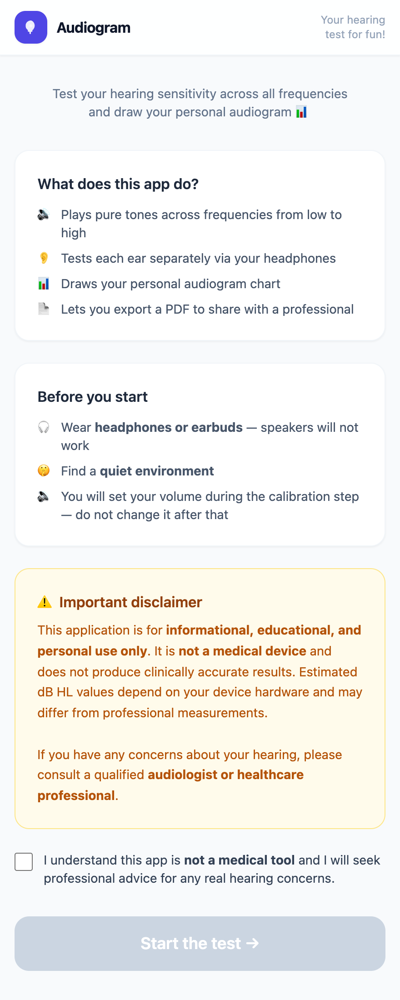
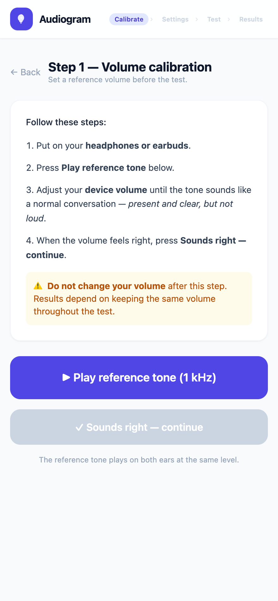
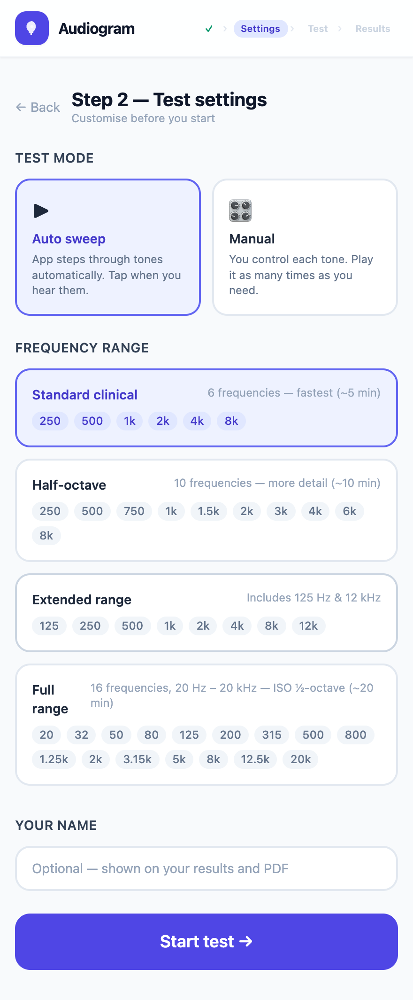
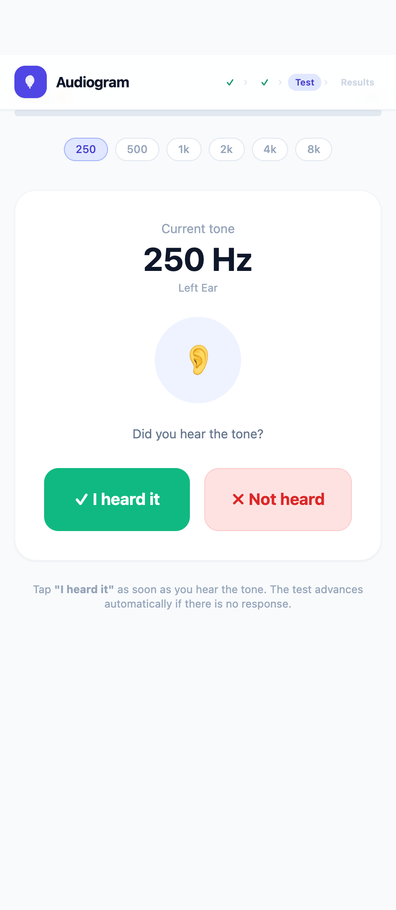
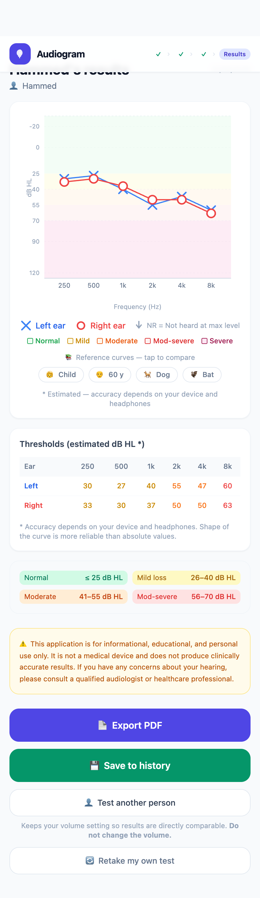
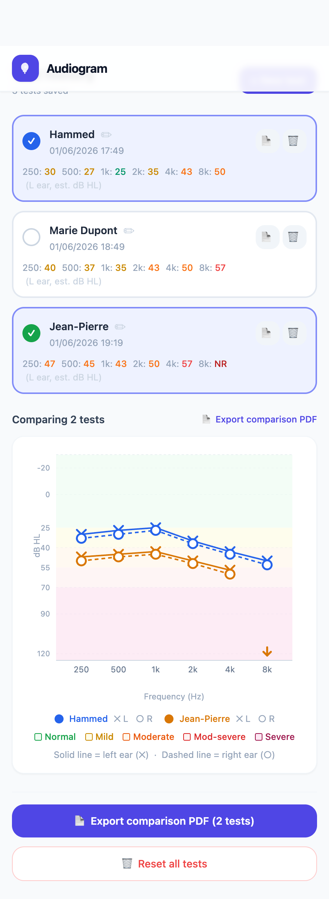

# 🎧 Audiogram — Personal Hearing Sensitivity Test

A free, open-source web application that lets anyone test their hearing sensitivity across all audible frequencies, draw a personal audiogram, and export a PDF report — entirely in the browser, with no backend and no data ever leaving the device.

### ▶️ [**Try the live demo →**](https://smramdani.github.io/audiogram/)

No install, no clone, no build — just open the link in your browser (with **headphones on**) and run a test. The demo runs entirely client-side; nothing is uploaded.

> ⚠️ **This app is for informational, educational, and personal use only.** It is not a medical device and does not produce clinically accurate results. If you have any concerns about your hearing, please consult a qualified audiologist or healthcare professional.

---

## ✨ Features

| Feature | Detail |
|---|---|
| 🔊 Pure-tone sweep | Sine-wave tones generated by the Web Audio API |
| 👂 Stereo ear isolation | Hard-panned left/right — tests each ear separately |
| 📐 Hughson-Westlake algorithm | Clinical threshold-search (down 10 dB / up 5 dB) with a fast 25 dB coarse descent that accelerates the early phase |
| 🔕 NR detection | Marks frequencies as "Not Heard" after 3 max-level misses |
| 📊 Standard audiogram chart | dB HL Y-axis (reversed), log-scale frequency X-axis |
| 🎨 Hearing-range bands | Colour bands: Normal / Mild / Moderate / Mod-severe / Severe |
| 📚 Pedagogic reference curves | Child, 60-year-old, dog 🐕 and bat 🦇 — toggleable overlays |
| ⚙️ Configurable frequency range | 4 presets from Standard Clinical (6 freqs) to Full Range (20 Hz–20 kHz) |
| 🎛 Manual & auto modes | Auto sweep with timeout, or manual tone-by-tone control |
| 🔁 Re-test any frequency | Tap a completed frequency chip to redo it |
| 🙋 Per-user name | Optional name shown on results and printed in the PDF |
| 📋 Test history | Save tests in the session; list with date/time, name and threshold summary |
| ✏️ Manage tests | Rename, delete individual tests, or reset all |
| 📈 Multi-user comparison | Select several saved tests and overlay them on one chart (per-user colour) |
| 👤 Test another person | Keeps the calibration anchor so results are directly comparable |
| 📄 PDF export | Client-side — single test (name, chart, table, disclaimer) **or** multi-user comparison |
| 🧭 Sticky app header | Step breadcrumb (Calibrate → Settings → Test → Results) + history shortcut |
| 📱 Mobile-first | Works on iOS Safari, Android Chrome, and desktop browsers |

---

## 🖼 Screenshots

<table>
  <tr>
    <td align="center" width="33%">
      <br>
      <sub><b>1. Landing</b> — what it does + mandatory disclaimer</sub>
    </td>
    <td align="center" width="33%">
      <br>
      <sub><b>2. Calibration</b> — 1 kHz reference tone</sub>
    </td>
    <td align="center" width="33%">
      <br>
      <sub><b>3. Setup</b> — mode, frequency preset, name</sub>
    </td>
  </tr>
  <tr>
    <td align="center" width="33%">
      <br>
      <sub><b>4. Test</b> — "I heard it / Not heard"</sub>
    </td>
    <td align="center" width="33%">
      <br>
      <sub><b>5. Results</b> — audiogram, bands, table, PDF export</sub>
    </td>
    <td align="center" width="33%">
      <br>
      <sub><b>6. History</b> — multi-user comparison chart</sub>
    </td>
  </tr>
</table>

---

## 🚀 Getting Started

### Prerequisites

- [Node.js](https://nodejs.org/) 18 or higher
- npm 9 or higher

### Install and run

```bash
# Clone the repository
git clone https://github.com/smramdani/audiogram.git
cd audiogram/audiogram-app

# Install dependencies
npm install

# Start the development server
npm run dev
```

Open [http://localhost:5173](http://localhost:5173) in your browser.

### Build for production

```bash
npm run build      # outputs to audiogram-app/dist/
npm run preview    # preview the production build locally
```

---

## 🗂 Project Structure

```
audiogram/
├── PRD.md                          # Product Requirements Document
└── audiogram-app/
    ├── index.html
    ├── package.json
    ├── vite.config.js
    ├── tailwind.config.js
    └── src/
        ├── main.jsx                # Entry point
        ├── App.jsx                 # Router (6 routes) wrapped in the sticky AppHeader
        ├── index.css               # Tailwind base styles
        │
        ├── audio/
        │   ├── audioEngine.js      # Web Audio API: sine-wave generator + stereo panning
        │   └── useThresholdSearch.js  # (legacy hook — threshold logic now lives in TestPage)
        │
        ├── context/
        │   └── SessionContext.jsx  # In-memory session state, test history, dBFS→dB HL conversion
        │
        ├── data/
        │   └── referenceCurves.js  # Pedagogic reference audiograms (child, 60y, dog, bat)
        │
        ├── components/
        │   ├── AppHeader.jsx       # Sticky header: logo, name, step breadcrumb, history shortcut
        │   ├── AudiogramChart.jsx  # Recharts scatter chart: bands, NR, toggleable ref curves
        │   └── ComparisonChart.jsx # Multi-user overlay chart (per-user colour, L=✕ / R=○)
        │
        ├── pages/
        │   ├── LandingPage.jsx     # Disclaimer + acknowledgement
        │   ├── CalibrationPage.jsx # 1 kHz reference tone + volume instruction
        │   ├── SetupPage.jsx       # Mode, frequency preset, user name
        │   ├── TestPage.jsx        # Threshold search engine (coarse + Hughson-Westlake fine)
        │   ├── ResultsPage.jsx     # Chart, table, save-to-history, PDF export
        │   └── HistoryPage.jsx     # Saved-test list, rename/delete/reset, compare, PDF
        │
        └── utils/
            └── formatFreq.js       # Frequency display helper (250 → "250 Hz", 3150 → "3.15 kHz")
```

---

## 🔬 How It Works

### 1. Volume Calibration

The Web Audio API controls **digital amplitude**, not physical Sound Pressure Level (SPL). To anchor the two:

1. The app plays a 1 kHz sine tone at **−20 dBFS** (a fixed digital level).
2. The user adjusts their **device volume** until it sounds like a normal conversation (~65 dB SPL).
3. This maps `−20 dBFS ↔ ~65 dB SPL` for the session.

All subsequent thresholds are converted using:

```
dB HL ≈ 65 + (thresholdDb − calibrationDb)
```

Where:
- `calibrationDb = −20 dBFS` (always — the digital level of the reference tone)
- `thresholdDb` = the dBFS level at which the user's threshold was found
- Lower dBFS = quieter sound heard = better hearing = lower dB HL ✓
- Higher dBFS = needs louder sound = worse hearing = higher dB HL ✓

> **Note:** `calibrationDb` is currently always `−20 dBFS`. The calibration step is *behavioural* — the app cannot read the OS volume level, so it trusts the user followed the instruction. This is the primary source of absolute measurement uncertainty.

### 2. Threshold Search (two-phase: coarse + Hughson-Westlake)

For each frequency the search runs in two phases. The **fine phase** is the standard clinical method; the **coarse phase** just gets there faster.

```
Start at −10 dBFS (clearly audible after calibration)

PHASE 1 — COARSE (fast bracketing):
  While heard → descend in 25 dB steps (tracking the last-heard level)
  On the first miss → hand over to the fine phase, resuming from the
  last-heard level (just above threshold)

PHASE 2 — FINE (Hughson-Westlake, unchanged):
  If heard     → step DOWN 10 dB
  If not heard → step UP   5 dB

Threshold found when:
  ≥ 2 ascending "heard" responses at the same level
  OR floor reached (−100 dBFS) and still heard
  OR 3 consecutive misses at MAX level (0 dBFS) → No Response (NR)
```

The fine phase uses the asymmetric down-10 / up-5 bracketing that converges quickly while resisting false positives. The coarse phase only accelerates the early descent — any mistake there costs a little *speed*, never *accuracy*, because the fine phase still does all the confirmation and self-corrects. The −100 dBFS floor lets the search reach very quiet thresholds for sensitive listeners.

### 3. Stereo Ear Isolation

Each tone is panned hard-left (`pan = −1`) or hard-right (`pan = +1`) using the Web Audio API `StereoPannerNode`. This requires the user to wear headphones or earbuds — speakers will cross-feed both ears.

### 4. NR (No Response)

If a user never hears a tone even at the maximum digital level (`0 dBFS`):
- After **3 consecutive misses at `0 dBFS`**, the frequency is marked **NR** (No Response).
- On the chart: displayed as a **downward arrow ↓** at the bottom boundary (clinical convention).
- In the table and PDF: displayed as **"NR"**.
- Typical for very low frequencies (20–32 Hz) and very high frequencies (12.5–20 kHz), which are at the edge of most headphone capability.

### 5. Frequency Range Presets

| Preset | Frequencies | Approx. duration |
|---|---|---|
| Standard clinical | 250, 500, 1k, 2k, 4k, 8k Hz | ~5 min |
| Half-octave | 250–8k Hz with half-octave steps | ~10 min |
| Extended | 125–12k Hz | ~8 min |
| **Full range** | **20 Hz – 20 kHz, ISO ½-octave (R4 series)** | **~20 min** |

The full-range preset uses the **ISO 266 R4 preferred frequencies**: 20, 32, 50, 80, 125, 200, 315, 500, 800, 1250, 2000, 3150, 5000, 8000, 12500, 20000 Hz. Each step multiplies the previous by √2 ≈ 1.414 (one half-octave).

> 20 Hz – 20 kHz is the complete human audible range. Going beyond 20 kHz enters ultrasound — outside normal headphone capability and human hearing.

---

## 📚 Pedagogic Reference Curves

The audiogram chart can overlay reference sensitivity curves for other species and age groups, for educational comparison:

| Curve | Key insight |
|---|---|
| 🧒 **Normal child (5–10 y)** | Slightly better sensitivity than adults, especially above 2 kHz |
| 👴 **60-year-old (typical)** | Classic *presbycusis* — flat low-frequency, steep high-frequency decline starting ~2 kHz |
| 🐕 **Dog** | Best at 2–8 kHz (up to ~65 kHz); poor below 200 Hz compared to humans |
| 🦇 **Bat (echolocating)** | Almost deaf below 1 kHz; exceptional sensitivity rising toward 20 kHz — their sweet spot *starts* where our chart ends |

Sources: Heffner & Heffner 1983 (dog), Simmons et al. 1979 (bat), ISO 7029 (human age curves).

---

## 🤝 Test History & Multi-User Comparison

The app keeps an **in-memory history of tests for the session** (no backend, cleared on page reload). From the results page:

- **💾 Save to history** — stores the current test (name, date/time, frequencies, results, calibration anchor).
- **👤 Test another person** — resets only the threshold results, *keeps* the calibration anchor and volume so the next person is measured on the same physical scale.
- **🔄 Retake my test** — full reset including calibration, for redoing your own test from scratch.

The **History page** (`/history`, reachable from the 📋 header shortcut) lets you:

- **List** every saved test with date/time, name and a colour-coded threshold summary.
- **Rename** a test inline (✏️) or **delete** it (🗑, with confirmation).
- **Compare** — select two or more tests to overlay them on a single chart, each user in their own colour (left ear = solid ✕, right ear = dashed ○).
- **Export PDF** — a single test, or a multi-user comparison report with per-participant threshold tables.
- **Reset all tests** — clear the whole history.

> Comparisons are only meaningful if **the device volume was not changed between tests**, since all dB HL values are computed against the same calibration anchor.

---

## 🏗 Tech Stack

| Layer | Choice | Why |
|---|---|---|
| Framework | React 19 + Vite | Fast build, HMR, no SSR needed |
| Audio | Web Audio API (native) | Pure-tone synthesis + stereo panning, no library needed |
| Routing | React Router v7 | Simple 6-page SPA |
| Charting | Recharts 3 | Responsive, customisable, ScatterChart for log-scale X |
| PDF | jsPDF + html2canvas | Client-side PDF, no server call |
| Styling | Tailwind CSS v3 | Mobile-first, utility classes |

**No backend. No database. No network requests.** Everything runs in the browser. No data is transmitted or stored externally.

---

## 📋 Known Limitations

| Limitation | Impact |
|---|---|
| Calibration is behavioural (no OS volume API) | Absolute dB HL values are approximate ±10–15 dB |
| No masking (clinical masking protocol) | Better ear may respond for worse ear at extreme levels |
| Headphone frequency response varies widely | Absolute thresholds unreliable at 20 Hz and 20 kHz |
| No bone-conduction testing | Cannot distinguish sensorineural from conductive loss |

The **shape** of the audiogram (which frequencies are relatively worse) is much more reliable than the absolute dB HL values.

---

## 🗺 Roadmap

**Done**
- [x] Iteration 1 — Disclaimer, calibration, auto sweep, audiogram chart, PDF export
- [x] Iteration 2 — Manual mode, re-test a frequency, frequency presets, app header
- [x] Multi-user **session** history: save, list, rename, delete, compare, comparison PDF
- [x] Full-range preset (20 Hz – 20 kHz), NR detection, −100 dBFS floor, coarse-descent acceleration

**Planned**
- [ ] PWA / offline support (installable, service worker)
- [ ] Persist history in `localStorage` so it survives page reload (currently in-memory only)
- [ ] Plain-language interpretation hints ("thresholds appear elevated at high frequencies")
- [ ] Loudness calibration improvement (optional sound-level-meter integration)

---

## 📄 License

**GNU Affero General Public License v3 (AGPL-3.0)**

Copyright © 2026 Hammed Ramdani

This project is free software — you can redistribute and modify it under the terms of the AGPL v3.
The key implication for a web app: if you run a **modified version as a network service**, you must
make the modified source code available to your users.

See [LICENSE](LICENSE) for the full license text.

---

## 🙏 Acknowledgements

- Audiometric standards: ISO 7029, ISO 389, ANSI S3.6
- Threshold-search method: Hughson & Westlake (1944), refined by Carhart & Jerger (1959)
- Species audiograms: Fay R.R. (1988) *Hearing in Vertebrates*, Heffner & Heffner (1983), Simmons et al. (1979)
